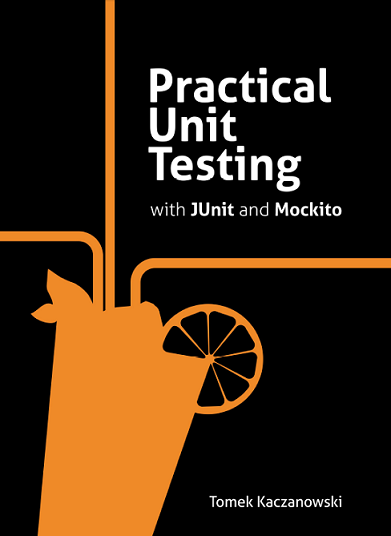

class: center, middle

# Stubbing and mocking

---

### Unit тестване на класове със зависимости

- Често клас, за да свърши своята работа, се обръща към други класове
  - Т.е. има член-данни, които са референции към други обекти (*композиция* на класове)
- Примери за композиция на класове:
  - `Car` has an `Engine` - не е много интересен пример за unit тестване, ако `Engine` е value object
  - `InvestmentWallet` has a (depends on) `QuoteService` ([2021-2022 lab exercise](https://github.com/fmi/java-course/tree/mjt-2021-2022/04-clean-code-collections/lab))
  - `UserService` has a (depends on) `UserRepository` (примерът от следващия слайд)
- Как unit тестваме такива класове? Инстанцирането им изисква да се подаде композираният клас. Каква имплементация на композирания клас трябва да подадем в unit тест?
- Нека да разгледаме в детайли един такъв пример

---

### Unit тестване на класове със зависимости - пример (1)

Нека `UserService` е клас, който борави с `User`-и, и съдържа бизнес логиката на нашето приложение

```java
public class UserService {

    private UserRepository repository;

    public User register(String email, String password) {
        if (repository.exists(email)) {
            throw new UserAlreadyExistsException();
        }

        User user = new User(email, password);
        repository.save(user);
        return user;
    }
}
```

---

### Unit тестване на класове със зависимости - пример (2)

`UserRepository` е интерфейс, чиято задача е да съхранява `User`-и (in-memory, file system, database, etc.)

```java
public interface UserRepository {

    boolean exists(String email);
    void save(User user);
}
```

<br>

`User` е record с полета `email` и `password`
```java
public record User(String email, String password) { }
```

`UserAlreadyExistsException` е runtime exception
```java
public class UserAlreadyExistsException extends RuntimeException { }
```

---

### Test cases for `register()`

- Методът `register()` има 2 exit point-a - следователно имаме 2 сценария за покриване
- [TC1] `register()` хвърля подходящо изключение, когато мейл адресът вече съществува в хранилището
- [TC2] `register()` запазва подходящия user в хранилището, когато мейл адресът не съществува в хранилището
- Как unit тестваме `UserService` класа?

---

### Unit тестване на класове със зависимости

- При unit тестване се интересуваме от функционалната коректност само на класа, който се тества (`UserService`)
  - Не се интересуваме от функционалата коректност на класа (`UserService`) и дадени имплементации на композирани класове (например `DatabaseUserRepositoryImpl`) -> това НЕ е unit тест
- Композираните класове могат да бъдат трудни за инстанциране. Например:
  - `UserRepository` имплементация да изисква връзка към база от данни (`DatabaseUserRepositoryImpl`)
  - `UserRepository` имплементация да изисква мрежова връзка към REST API (`FooCompanyUserRepositoryImpl`)

---

### Unit тестване на класове със зависимости

- Трябват ни инструменти, чрез които да контролираме и изолираме композираните класове
- Доброто unit тестване се базира на изолация
- Изолацията се постига чрез т.нар *stub* (*fake*) или *mock* обекти

---

### Stubbing

- *Stub* наричаме клас, който отговаря на дадени извиквания на методи с предварително зададени отговори
- Обикновено имплементират по минимален начин даден интерфейс и се подават на класа, който се тества
- В unit тестването ни служат за справяне с проблема с композираните класове
- Извън unit тестването, могат да бъдат използвани и като заместител на код, който още не е разработен

---

### `PositiveUserRepositoryStubImpl`

```java
public class PositiveUserRepositoryStubImpl implements UserRepository {

    @Override
    public boolean exists(String email) {
        return true;
    }

    @Override
    public void save(User user) {
        // Do nothing
    }
}
```

---

### `InMemoryUserRepositoryStubImpl`

```java
public class InMemoryUserRepositoryStubImpl implements UserRepository {

    private Map<String, User> users = new HashMap<>();

    @Override
    public boolean exists(String email) {
        return users.containsKey(email);
    }

    @Override
    public void save(User user) {
        users.put(user.email(), user);
    }
}
```

---

### The stub way

```java
@Test
void testRegisterThrowsAppropriateException() {
    UserRepository repository = new PositiveUserRepositoryStubImpl()
    UserService service = new UserService(repository);

    assertThrows(UserAlreadyExistsException.class,
        () -> service.register("test@test.com", "weak"),
        "Expected UserAlreadyExistsException but it was not thrown");
}
```

---

### Жизнен цикъл на тестване със stub

1. Setup data - подготвяме обекта, който ще се тества, както и stub зависимостите му
2. Exercise - извикваме метода, който искаме да тестваме
3. Verify state - използваме assertions, за да проверим състоянието на обекта
4. Teardown - освобождаваме използваните ресурси

---

### Характеристики на stub-овете

- Stubbing-ът е legacy подход, който в наши дни е заместен от mocking библиотеки (-)
- Броят на stub-овете расте експоненциално спрямо сложността на нашата бизнес логика (-)
- Не може лесно да проверим дали даден метод на stub-a е извикан и с какви аргументи е извикан (-)
- Могат да съдържат логика, която не е тривиална (напр. `InMemoryUserRepositoryStubImpl`) (+)

---

### Mocking

- *Mock* наричаме обект, който програмно конфигурираме с дадени отговори на дадени извиквания на методи
- Mock-овете ни позволяват лесно да се провери дали даден метод на mock-a е извикан и с какви аргументи е извикан
- Инструмент, чрез който контролираме и изолираме композираните класове

---

### The mock way

```java
@Test
void testRegisterThrowsAppropriateException() {
    UserRepository mock = mock();
    when(mock.exists("test@test.com")).thenReturn(true);

    UserService service = new UserService(mock);

    assertThrows(UserAlreadyExistsException.class,
        () -> service.register("test@test.com", "weak"),
        "Expected UserAlreadyExistsException but it was not thrown");

    verify(mock, never()).save(any());
}
```

---

### Жизнен цикъл на тестване с mock

1. Setup data - подготвяме обекта, който ще се тества, както и mock събратята му
2. Setup expectations - задаваме желаните отговори
3. Exercise - извикваме метода, който искаме да тестваме
4. Verify expectations - уверяваме се, че правилният метод на mock-a се е извикал
5. Verify state - използваме assertions, за да проверим състоянието на обекта
6. Teardown - освобождаваме използваните ресурси

---

### Mocking библиотеки

- [Mockito](https://github.com/mockito/mockito)
  - Ще разглеждаме mockito (5.20.x) като mocking библиотека
  - Една от 10-те най-популярни Java библиотеки изобщо
  - JUnit е стандарт за unit testing framework, mockito е стандарт за mocking библиотека
  - Open-source
- [EasyMock](https://github.com/easymock/easymock)
- [PowerMock](https://github.com/powermock/powermock) [*]

<sub>[*] Putting it in the hands of junior developers may cause more harm than good.</sub>

---

### Mockito

.center[]

---

### Mockito - Why do we drink it?

- Лесен за ползване - mock, use, verify
- Програматично създаване на mock-ове посредством `mock()`
- Програматично конфигуриране на отговори
  - `when(mock.exists("test@test.com")).thenReturn(true)`
- Програматична верификация на интеракциите с mock-a
  - `verify(mock, never()).save(any())`
- Annotation sugar посредством `@Mock` анотацията

---

### Setup (ръчно сваляне от mvnrepository-то)

- Mockito е външна библиотека, която може да бъде изтеглена от mvnrepository-то
- Изтеглете [mockito-core@5.20.0](https://mvnrepository.com/artifact/org.mockito/mockito-core/5.20.0) jar-a и 3-те му dependency-та
- Ако искате да боравите с `@Mock` анотацията, изтеглете и [mockito-junit-jupiter@5.20.0](https://mvnrepository.com/artifact/org.mockito/mockito-junit-jupiter/5.20.0)
- В IDE-то добавете въпросните jar-ки в class path-a на проекта си

---

### Setup (IntelliJ)

1. Right click on the Project and select `Open Module Settings`
1. From `Project Settings`, select `Libraries`
1. Click on the `+` to add a new project library
1. Choose `From Maven...`
1. In the search bar, type `mockito-core` and choose `org.mockito:mockito-core:5.20.0`
1. Select `Download to` and make sure the `lib/` dir in the project root is configured
1. Click `Apply`, then click `Ok`
1. Ensure that jar files of mockito and its dependencies are downloaded under `lib/`

---

### Setup

```
fancy-project
    ├─ src/
    │   └─ (...)
    ├─ test/
    │   └─ (...)
    └─ lib/
        ├─ byte-buddy-1.17.7.jar
        ├─ byte-buddy-agent-1.17.7.jar
        ├─ mockito-junit-jupiter-5.20.0.jar
        ├─ mockito-core-5.20.0.jar
        └─ objenesis-3.3.jar
```

---

### `mock()` и `verify()`

```java
import static org.mockito.Mockito.*;

List mockedList = mock();

mockedList.add("one");  // returns false
mockedList.clear();     // void, does nothing
mockedList.get(0);      // returns null, no when() is set up for get(0)
mockedList.get(1);      // returns null, no when() is set up for get(1)

verify(mockedList).add("one");
verify(mockedList, atLeastOnce()).clear();
verify(mockedList, never()).add("two");
```

---

### `when()`

```java
LinkedList mockedList = mock();

when(mockedList.get(0)).thenReturn("first");
when(mockedList.get(1)).thenThrow(new RuntimeException());

mockedList.get(0);  // returns "first"
mockedList.get(1);  // throws RuntimeException
```

---

### Argument matchers

```java
when(mockedList.get(anyInt())).thenReturn("element");
when(mockedList.add(startsWith("foo"))).thenReturn(true);

mockedList.get(999);       // returns "element"
mockedList.add("foobar");  // returns true
```

---

### Добри практики

- Mock-вайте само толкова колкото ви трябва за конкретния тест
- Не mock-вайте value обекти
- Keep it short and simple (KISS)
- Redesign when you cannot test it

---

### Полезни четива

- [JUnit User Guide](https://docs.junit.org/current/user-guide/index.html)
- [Unit Testing with JUnit](http://www.vogella.com/tutorials/JUnit/article.html)
- [Mockito Reference Documentation](https://javadoc.io/doc/org.mockito/mockito-core/latest/org.mockito/org/mockito/Mockito.html)
- [Mocks aren't stubs](https://martinfowler.com/articles/mocksArentStubs.html) by Martin Fowler
- [Writing good tests](https://github.com/mockito/mockito/wiki/How-to-write-good-tests) by Mockito team

---

### Полезни четива

.center[]

---

## Въпроси?

.font-xl[.ri-github-fill.icon-inline[[fmi/java-course](https://github.com/fmi/java-course)]]

.font-xl[.ri-youtube-fill.icon-inline[[MJT2026](https://www.youtube.com/playlist?list=PLew34f6r0Pxx6LmzYcc9-8-_-T3ZPZTXg)]]
